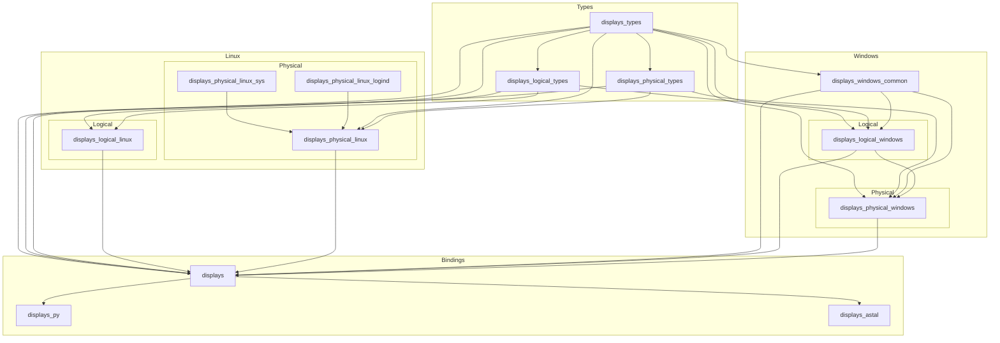

# displays

`displays` lets you query and update logical and physical display information on Linux and Windows. Logical display state covers things like enabled state, orientation, resolution, and placement. Physical display state currently focuses on brightness.

The workspace is split into a small set of focused crates: shared type crates, Linux and Windows backends, the top-level `displays` crate, and bindings for Python and GLib/GObject consumers.

There is also a small CLI example in `examples/cli` for local experimentation.

It's not yet recommended for day-to-day use, but I encourage you to try it out and experiment.

## Workspace Layout



## Published Crates

- `displays`: high-level cross-platform API for querying and updating displays
- `displays_types`: shared base types such as `DisplayIdentifier`, `Point`, and `Size`
- `displays_logical_types`: shared logical-display domain types
- `displays_physical_types`: shared physical-display domain types
- `displays_logical_linux`: Linux logical display support via Wayland and wlr output management
- `displays_physical_linux_sys`: low-level Linux sysfs brightness backend
- `displays_physical_linux_logind`: Linux brightness updates through systemd-logind
- `displays_physical_linux`: Linux physical brightness backend orchestration
- `displays_windows_common`: shared Windows display helpers
- `displays_logical_windows`: Windows logical display querying and updates
- `displays_physical_windows`: Windows physical brightness support
- `displays_py`: PyO3-based Python bindings exposing the `displays` module
- `displays_astal`: GLib/GObject bindings around `displays`

## Rust Usage

```rust
use displays::{manager::DisplayManager, types::*};

fn main() -> Result<(), Box<dyn std::error::Error>> {
    let displays = DisplayManager::query()?;

    for display in &displays {
        println!("{display:#?}");
    }

    let results = DisplayManager::apply(
        vec![DisplayUpdate {
            id: DisplayIdentifier {
                name: Some("DELL U2720Q".to_string()),
                serial_number: None,
            },
            logical: None,
            physical: Some(PhysicalDisplayUpdateContent {
                brightness: Some(50),
            }),
        }],
        false,
    )?;

    assert_eq!(results.len(), 1);
    assert!(!results[0].applied.is_empty());
    Ok(())
}
```

## Python Usage

The Python bindings live in `displays_py/` and expose the module name `displays`.

For local development:

```bash
cd displays_py
uv sync --reinstall-package displays
uv run python -c "import displays; print(displays.query())"
```

There is also a simple example script at `displays_py/examples/everything.py`.

## Support Matrix

| Platform | Logical | Logical | Logical | Logical | Physical |
| --- | --- | --- | --- | --- | --- |
|  | Enabled | Orientation | Resolution | Position | Brightness |
| Windows | Supported | Supported | Experimental | Experimental | Supported |
| Linux | Unsupported | Unsupported | Unsupported | Unsupported | Supported |
| macOS | Unsupported | Unsupported | Unsupported | Unsupported | Unsupported |
