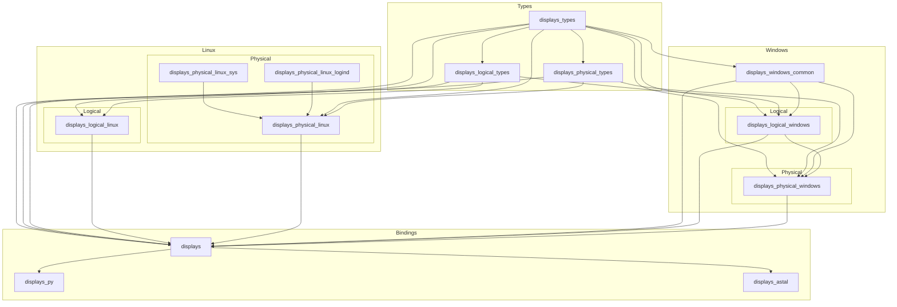

<!-- This file is generated from docs/readme/root/README.src.md. Do not edit directly. -->

# displays

`displays` lets you query and update logical and physical display information on
Linux and Windows. Logical display state covers things like enabled state,
orientation, resolution, and placement. Physical display state currently focuses
on brightness.

The workspace is split into a small set of focused crates: shared type crates,
Linux and Windows backends, the top-level `displays` crate, and bindings for
Python and GLib/GObject consumers.

The most useful workflows today are:

- querying the current logical and physical display state
- matching displays by a friendly identifier such as name or serial number
- validating updates before applying them
- applying brightness updates on Linux and Windows
- consuming the same high-level API from Rust, Python, or GI-based environments

There is also a small CLI example in `examples/cli` for local experimentation.

## Workspace Layout



## Published Crates

- `displays`: high-level cross-platform API for querying and updating displays
- `displays_types`: shared base types such as `DisplayIdentifier`, `Point`, and `Size`
- `displays_logical_types`: shared logical-display domain types
- `displays_physical_types`: shared physical-display domain types
- `displays_logical_linux`: Linux logical display support via Wayland and wlr output management
- `displays_physical_linux_sys`: low-level Linux sysfs brightness backend
- `displays_physical_linux_logind`: Linux brightness updates through systemd-logind
- `displays_physical_linux`: Linux physical brightness backend orchestration
- `displays_windows_common`: shared Windows display helpers
- `displays_logical_windows`: Windows logical display querying and updates
- `displays_physical_windows`: Windows physical brightness support
- `displays_py`: PyO3-based Python bindings exposing the `displays` module
- `displays_astal`: GLib/GObject bindings around `displays`

## Rust Example

The top-level `displays` crate can query display state, match displays by a
user-facing identifier, and apply updates.

```rust,no_run
use displays::{
    display::DisplayUpdate,
    manager::DisplayManager,
    types::{DisplayIdentifier, PhysicalDisplayUpdateContent},
};

fn main() -> Result<(), Box<dyn std::error::Error>> {
    let displays = DisplayManager::query()?;

    for display in &displays {
        println!("{display:#?}");
    }

    let results = DisplayManager::apply(vec![DisplayUpdate {
        id: DisplayIdentifier {
            name: Some("DELL U2720Q".to_string()),
            serial_number: None,
        },
        logical: None,
        physical: Some(PhysicalDisplayUpdateContent {
            brightness: Some(50),
        }),
    }], false)?;

    assert_eq!(results.len(), 1);
    Ok(())
}
```

## Python Setup

For local development inside `displays_py/`:

```bash
uv sync --reinstall-package displays
uv run ipython
```

## Python Example

The `displays_py` crate exposes the Python module name `displays` with the same
high-level `query`, `get`, `apply`, and `validate` operations.

```python
import displays

for display in displays.query():
    print(display)

results = displays.apply([
    displays.DisplayUpdate(
        id=displays.DisplayIdentifier(name="DELL U2720Q"),
        physical=displays.PhysicalDisplayUpdateContent(brightness=50),
    ),
])

print(results)
```

## Backend Selection

The library supports two backend modes:

- default: real display queries and updates through `displays::DisplayManager`
- `faked` feature: deterministic fake data for smoke testing and typelib work

The fake backend is intentionally kept in-tree so the GI surface can be tested
without touching real hardware.

## Building

Default build, using the real backend:

```sh
cargo build -p displays_astal --release
meson setup build
meson compile -C build
```

Fake build, using the `faked` Cargo feature:

```sh
cargo build -p displays_astal --release --features faked
meson setup build-faked -Dfaked=true
meson compile -C build-faked
```

## Smoke Testing

The repository includes a fake-backend GJS smoke test at `examples/test.js`.
It expects a typelib built with the `faked` feature.

```sh
env GI_TYPELIB_PATH="$PWD/build-faked" gjs -m "$PWD/examples/test.js"
```

## Astal / GI Example

`displays_astal` exposes an async GI API that can be consumed from GJS or
TypeScript while delegating the actual display work to the Rust `displays`
crate.

```ts
import Gio from "gi://Gio";
import GLib from "gi://GLib";
import DisplaysAstal from "gi://DisplaysAstal";

Gio._promisify(DisplaysAstal.Manager.prototype, "query_async", "query_finish");
Gio._promisify(DisplaysAstal.Manager.prototype, "get_async", "get_finish");
Gio._promisify(DisplaysAstal.Manager.prototype, "update_async", "update_finish");
Gio._promisify(DisplaysAstal.Manager.prototype, "validate_async", "validate_finish");

async function main() {
    const manager = DisplaysAstal.Manager.get_default();

    const displays = await manager.query_async(null);
    for (const display of displays) {
        const name = display.id.name ?? "unknown";
        const serial = display.id.serial_number ?? "unknown";
        print(`${name} (${serial})`);
    }

    const results = await manager.update_async([
        new DisplaysAstal.DisplayUpdate({
            id: new DisplaysAstal.DisplayIdentifier({ name: "Missing Display" }),
            physical: new DisplaysAstal.PhysicalDisplayUpdateContent({
                has_brightness: true,
                brightness: 50,
            }),
        }),
    ], null);

    print(`apply returned ${results.length} result(s)`);
}

main().catch(err => {
    printerr(`DisplaysAstal error: ${err.message}`);
    GLib.exit(1);
});
```
