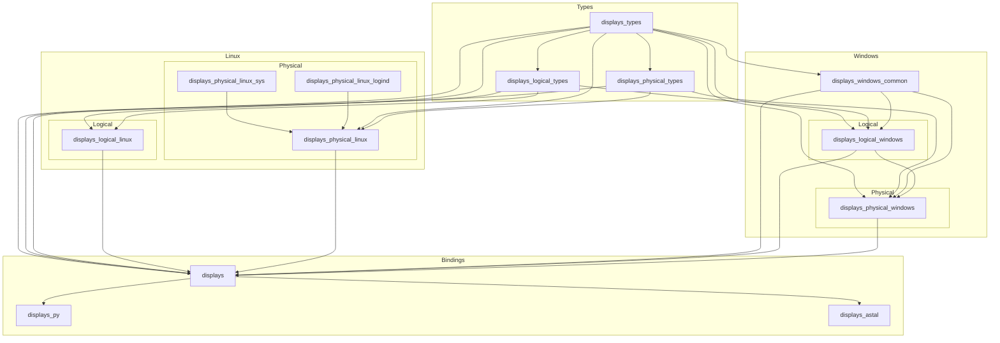

## Workspace Layout

```mermaid
graph TD
    subgraph Types
        displays_types[displays_types]
        displays_logical_types[displays_logical_types]
        displays_physical_types[displays_physical_types]
    end

    subgraph Linux
        subgraph Linux_Logical[Logical]
            displays_logical_linux[displays_logical_linux]
        end

        subgraph Linux_Physical[Physical]
            displays_physical_linux_sys[displays_physical_linux_sys]
            displays_physical_linux_logind[displays_physical_linux_logind]
            displays_physical_linux[displays_physical_linux]
        end
    end

    subgraph Windows
        displays_windows_common[displays_windows_common]

        subgraph Windows_Logical[Logical]
            displays_logical_windows[displays_logical_windows]
        end

        subgraph Windows_Physical[Physical]
            displays_physical_windows[displays_physical_windows]
        end
    end

    subgraph Bindings
        displays[displays]
        displays_py[displays_py]
        displays_astal[displays_astal]
    end

    displays_types --> displays_logical_types
    displays_types --> displays_physical_types
    displays_types --> displays_logical_linux
    displays_logical_types --> displays_logical_linux
    displays_types --> displays_windows_common
    displays_types --> displays_logical_windows
    displays_logical_types --> displays_logical_windows
    displays_windows_common --> displays_logical_windows
    displays_physical_linux_sys --> displays_physical_linux
    displays_physical_linux_logind --> displays_physical_linux
    displays_types --> displays_physical_linux
    displays_physical_types --> displays_physical_linux
    displays_types --> displays_physical_windows
    displays_physical_types --> displays_physical_windows
    displays_windows_common --> displays_physical_windows
    displays_logical_windows --> displays_physical_windows

    displays_types --> displays
    displays_logical_types --> displays
    displays_physical_types --> displays
    displays_logical_linux --> displays
    displays_physical_linux --> displays
    displays_windows_common --> displays
    displays_logical_windows --> displays
    displays_physical_windows --> displays
    displays --> displays_py
    displays --> displays_astal
```
